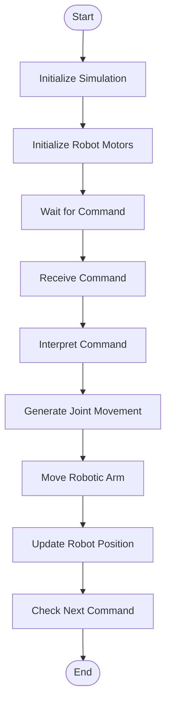

## Simulation Environment Design
The simulation environment represents the virtual workspace where the robotic arm will operate. The environment is designed to replicate a tabletop
assistive manipulation scenario, where the robot interacts with objects placed on a table.
This environment allows the robotic arm to perform basic pick-and-place tasks, such as grasping objects and moving them to another location.

The simulation environment contains the following elements:
| Element     | Description                                                  |
|-------------|--------------------------------------------------------------|
| Floor       | Represents the base ground of the simulation world           |
| Table       | Provides a working surface for object manipulation           |
| Objects     | Items that the robotic arm will pick and place               |
| Robot Base  | Fixed mount where the robotic arm is attached                |

Environment Layout Concept

## Simulation Architecture
The simulation architecture defines the structure of the simulation system and how different components interact within the Webots environment.
The system consists of four primary components:
	1.	Simulation Environment – the physical workspace of the robot.
	2.	Robotic Arm Model – the structure of the robot and its joints.
	3.	Control Interface – receives commands from the user.
	4.	Python Controller – processes commands and controls robot movement.

This architecture ensures that user inputs are correctly translated into robotic arm movements within the simulation.
Simulation Architecture Diagram

Architecture Description

The Webots simulation environment acts as the main platform where all components operate together.
The simulation environment provides the physical space where the robot operates.
The robotic arm model represents the mechanical structure of the arm with its joints.
The control interface allows the user to control the robot through joystick input or voice commands.
The Python controller processes commands and converts them into joint movements.
The Python controller communicates with the robotic arm motors to control movement during the simulation.

Webots Controller Setup
The Webots simulation will use a Python-based controller program.
The controller performs the following tasks:
-Initialize the simulation
-Access the robot motors
-Receive user commands
-Convert commands into joint movements
-Update the robot position in the simulation

Example control structure:
Initialize Robot
Get Motor Devices
Wait for Command
Interpret Command
Move Joint Motor
Update Simulation
Repeat

## Control System Design and Flow Diagram
The control system defines how the robotic arm behaves and responds to user commands in the simulation.
The robotic arm will perform assistive pick-and-place tasks using joint movements controlled by the Python controller.
The control system translates user commands into servo motor movements for each joint of the robotic arm.
Robotic Arm Joint Structure

The robotic arm consists of six degrees of freedom, which allow flexible movement and manipulation.
| Joint | Function |
|------|----------|
| J1 Base | Rotates arm left and right |
| J2 Shoulder | Raises and lowers the arm |
| J3 Elbow | Extends the arm forward |
| J4 Wrist Pitch | Adjusts vertical wrist orientation |
| J5 Wrist Roll | Rotates the wrist |
| J6 Gripper | Opens and closes to grasp objects |

 
Control System Explanation

The control system operates continuously during the simulation.
1.	The simulation starts by initializing the robotic arm and its motors.
2.	The system waits for a command from the user.
3.	When a command is received, the controller interprets the command.
4.	The controller converts the command into joint motor movements.
5.	The robotic arm moves accordingly.
6.	The system updates the robot’s position in the simulation.

This loop continues until the simulation ends.
